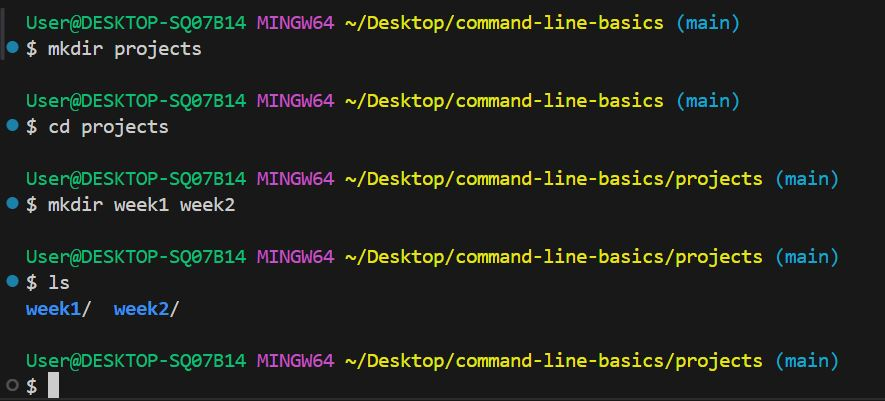
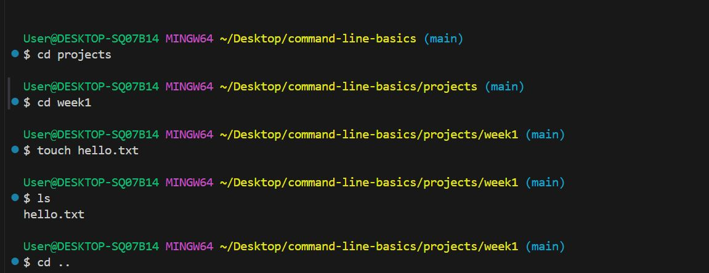
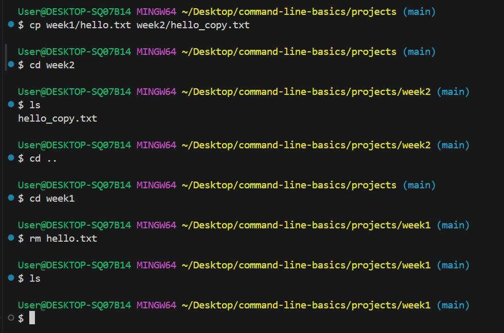
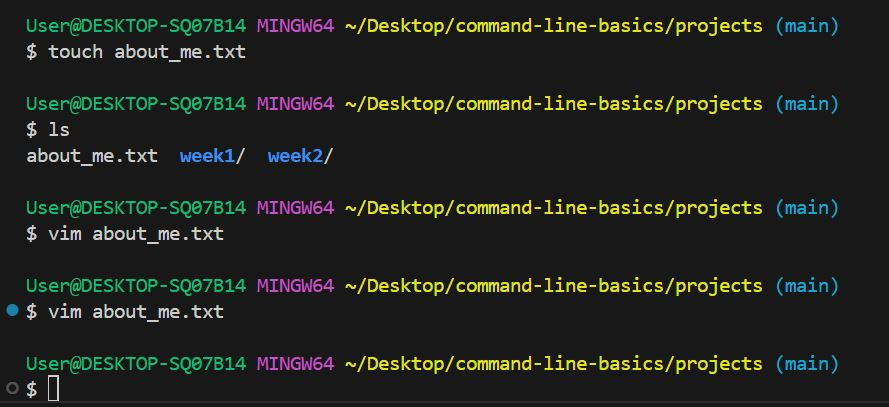
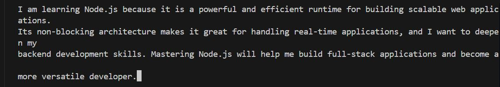

# command-line-basics

**Create a directory structure on Linux:**

Create a folder named projects.
Inside projects, create subfolders: week1, week2.

**Solution**

Go to your terminal, using GitBash or Linux. For this assignment I am using GitBash.
i. Create a directory and create a folder named "Projects" using.

**mkdir projects**

ii. To create subfolders: week1, week2, inside "projects" folder.
Firstly, I made sure i was in my "project" folder using this prompt.

**cd projects**

Secondly, I then created my subfolders: week1, week2 using this prompt.

**mkdir week1 week2**

To be sure my subfolders were created in my projects folder using this prompt.

**ls**

This was how my output looked like after completing task 1.

**2. Use Linux commands to:**

Create an empty file named hello.txt inside week1.
Copy hello.txt to week2 and rename it to hello_copy.txt.
Delete the original hello.txt from week1.

**Solution**

i. To create an empty file named "hello.txt" in week1, first, I went to my week1 subfolder using.

**cd week1**

Then, I created empty file named hello.txt in week1 subfolder using.

**touch hello.txt**

I prompted **ls** to show my hello.txt in week1 subfolder.

ii. To copy "hello.txt" to week2 and rename it to "hello_copy.txt". Firstly, I went back to my "projects" folder that contains subfolders week1, week2 using this prompt.

**cd ..**

To copy "hello.txt" to week2 and rename it to "hello_copy.txt", I used this prompt.

**cp week1/hello.txt week2/hello_copy.txt**

I "cd" into my week2 subfolder and "ls" to view the renamed hello_copy.txt.

iii. To delete the original "hello.txt" file from week1, I "cd .."back to projects folder and "cd" into subfolder week1. I deleted the hello.txt file using this prompt.

**rm hello.txt**

I "ls" into week1 folder to confirmed that hello.txt is deleted.

**3. Write a short paragraph in a text file (about_me.txt) using a command-line text editor vim, describing your motivation for learning Node.js.**

**Solution**

i. I created a text file "about_me.txt" in my projects folder using this prompt.

**touch about_me.txt**

I "ls" to see if "about _me.txt" file was created. Then i "cd" into my "about_me.txt" file.

To write a short Paragraph in my text file using command line text editor, i used this prompt.

**vim about_me.txt**

To enable me write on text file, I clicked on **i** and when I finished writing I pressed **Esc** key and save the write up with this prompt.

**:wq**

